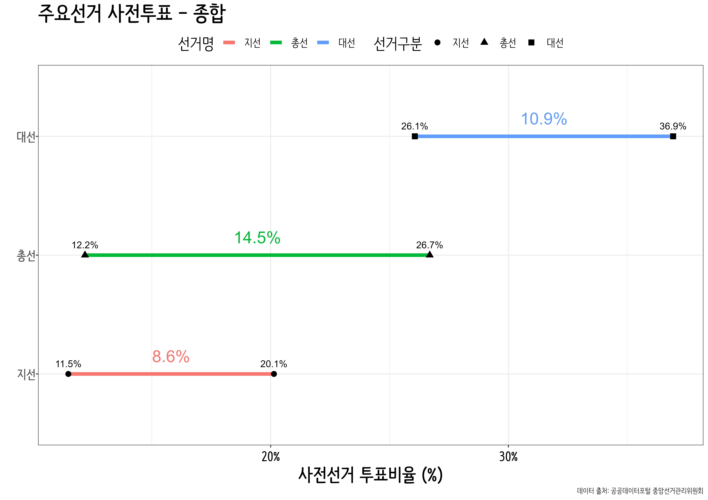

```{r setup, include=FALSE}
knitr::opts_chunk$set(echo = TRUE, message=FALSE, warning=FALSE,
                      comment="", digits = 3, tidy = FALSE, prompt = FALSE, fig.align = 'center')
library(tidyverse)
library(rvest)
library(lubridate)
library(ggrepel)
library(sf)
library(geogrid)
library(tilemaps)
```

# .역대 사전 투표율 {#local-gg-data}


```{r early-voting, eval = FALSE}

## 원본 데이터 가져오기-------------

nec_early_voting <- krvote::early_voting %>% 
  janitor::clean_names(ascii = FALSE) %>% 
  mutate(across(선거인수:사전투표율, parse_number)) %>% 
  filter(투표일 == "0") %>% 
  group_by(선거코드) %>%  
  summarise(선거인수 = sum(선거인수),
            사전투표자수 = sum(사전투표자수) ) %>% 
  mutate(사전투표율 = 사전투표자수 / 선거인수)
  
advance_vote_tbl


nec_early_voting_tbl <- nec_early_voting %>% 
  mutate(유형 = case_when( str_detect(선거코드, "20160413|20200415") ~ "총선",
                           str_detect(선거코드, "20180613") ~ "지선",
                           str_detect(선거코드, "20170509") ~ "대선")) %>% 
  mutate(전후 = case_when(str_detect(선거코드, "20180613") & str_detect(유형, "지선") ~ "두번째",
                          str_detect(선거코드, "20160413") & str_detect(유형, "총선") ~ "첫번째",
                          str_detect(선거코드, "20200415") & str_detect(유형, "총선") ~ "두번째",
                          str_detect(선거코드, "20170509") & str_detect(유형, "대선") ~ "첫번째")) %>% 
  select(유형, 전후, 사전투표율) %>% 
  add_row("유형" = "지선", "전후" = "첫번째", "사전투표율" = 11.49 / 100) %>% 
  add_row("유형" = "대선", "전후" = "두번째", "사전투표율" = 36.93 / 100) %>% 
  group_by(유형) %>% 
  mutate(차이 = abs(diff(사전투표율)) ) %>% 
  arrange(유형) %>% 
  ungroup() %>% 
  mutate(paired = rep(1:(n()/2), each = 2)) %>% 
  mutate(전후 = factor(전후, levels = c("첫번째", "두번째"))) 

nec_early_voting_tbl

advance_vote_president_g <- nec_early_voting_tbl %>% 
  mutate(유형 = factor(유형, levels = c("대선", "총선", "지선")) %>% fct_rev) %>% 
  ggplot(aes(x = 유형, y = 사전투표율)) +
    geom_point() +
    geom_line(aes(group = paired, color = 유형), size = 2)+
    geom_point(aes(shape = 유형), size=3 ) +
    coord_flip() +
    scale_y_continuous(labels = scales::percent) +
    theme_bw(base_family = "NanumBarunPen") +
    theme(legend.position = "top",
          legend.title=element_text(size=19), 
          legend.text=element_text(size=13),
          strip.text.x = element_text(size = rel(1.5), colour = "black", face="bold"),
          strip.text.y = element_text(size = rel(1.5), colour = "black", face="bold"),
          axis.text.y = element_text(size = rel(1.7), colour = "gray35", face="bold", 
                                     margin = margin(t = 0, r = 0, b = 0, l = 00)),
          axis.text.x = element_text(size = rel(1.7), angle = 0,  vjust = 0.5, colour = "black",  face="bold"),
          axis.title.x = element_text(size = rel(2.0), angle = 0,  vjust = 0.5, colour = "black",  face="bold"),
          strip.background=element_rect(fill="gray95"),
          plot.title=element_text(size=25, face="bold", family = "NanumBarunpen"),
          plot.subtitle=element_text(face="bold", size=17, colour="grey10", family = "NanumBarunpen"))  +
  labs(x = "",
       y = "사전선거 투표비율 (%)",
       color = "선거명",
       shape = "선거구분",
       title = "주요선거 사전투표 - 종합",
       caption = "데이터 출처: 공공데이터포털 중앙선거관리위원회") +
  geom_text(aes(label = scales::percent(사전투표율, accuracy = 0.1)), vjust = -1.0, size = 4) +
  geom_text(data = nec_early_voting_tbl %>% filter(전후 == "첫번째") %>% mutate(show_value = 사전투표율 + 차이/2), 
            aes(x = 유형, y =  show_value, label = scales::percent( 차이 ), color = 유형), vjust = -1.0, size = 7, 
            show.legend = FALSE)

advance_vote_president_g

ragg::agg_png(glue::glue("fig/advance_vote_president_g.png"), width = 297, height = 210, units = "mm", res = 600)
advance_vote_president_g
dev.off()

```





# 제20대 대선 사전투표율 {#local-gg-data-gusign-early-voting}

## 시도 사전투표율 데이터 {#local-gg-data-gusign-early-voting-data}

```{r early-voting-map-data3}

presid_casting <- krvote::election_20220309$투표율

presid_casting_tbl <- presid_casting %>% 
  group_by(시도명, 구시군명, 투표구명) %>% 
  summarise(선거인수 = sum(선거인수),
            투표수   = sum(투표수)) %>% 
  ungroup() %>% 
  # filter(!str_detect(투표구명, "잘못")) %>% 
  mutate(투표구명 = ifelse(str_detect(투표구명, "공관"), "재외투표", 투표구명)) %>% 
  mutate(투표유형 = case_when(str_detect(투표구명, "선상투표|관외사전투표|재외투표|(잘못 투입)") ~ 투표구명,
                              str_detect(투표구명, "관내사전투표") ~ "관내사전투표",
                              TRUE ~ "본투표"))

## 값 확인 --------------------
presid_casting_tbl %>% 
  group_by(투표유형) %>% 
  summarise(선거인수 = sum(선거인수),
            투표수   = sum(투표수)) %>% 
  mutate(사전투표율 = 투표수 / 선거인수) %>% 
  summarise(선거인수 = sum(선거인수),
            투표수 = sum(투표수))
  
#   선거인수   투표수
#      <dbl>    <dbl>
# 1 44197692 34067853

```


## 시도 사전투표율 시각화 {#local-gg-data-gusign-early-voting-data}

```{r early-voting-map-data6}
library(tidytext)

sido_vote <- presid_casting_tbl %>% 
  mutate(투표유형 = ifelse(str_detect(투표유형, "사전투표"), "관내외사전투표", 투표유형)) %>% 
  filter(!str_detect(투표구명, "잘못")) %>%
  group_by(시도명, 투표유형) %>%
  summarise(선거인수 = sum(선거인수),
            투표수   = sum(투표수)) %>% 
  mutate(투표율 = 투표수 / sum(선거인수) ) %>% 
  ungroup() 

sido_cating_g <- sido_vote %>% 
  mutate(시도 = 시도명) %>% 
  mutate(시도명 = reorder_within(x = 시도명, by = 투표율, within = 투표유형)) %>% 
  filter(투표유형 %in% c("관내외사전투표", "본투표")) %>% 
  mutate(투표유형 = factor(투표유형, levels = c("관내외사전투표", "본투표", "거소·선상투표", "재외투표"))) %>% 
  ggplot(aes(x = fct_reorder(시도명, 투표율), y = 투표율  ) ) +
    geom_point(show.legend = FALSE, aes(color = 시도), size = 3) +
    geom_segment( aes(x=시도명, xend=시도명, y=0, yend=투표율, color = 시도)) +
    facet_wrap(~투표유형, scales = "free_y") +
    coord_flip() +
    scale_x_reordered() +
    scale_y_continuous(labels = scales::percent, limits = c(0, 0.55)) +
    scale_color_manual(values = c("전라남도" = "blue",
                                  "전라북도" = "blue",
                                  "광주광역시" = "blue",
                                  "대구광역시" = "red",
                                  "경상북도" = "red",
                                  "경기도"   = "black"
                                 ) ) +
    theme_minimal(base_family = "NanumBarunPen") +
    theme(
        text = element_text(family = "NanumGothic"),
        plot.tag.position = c(0.85, .97),
        legend.position = "none",
        legend.title=element_text(size=15), 
        legend.text=element_text(size=13),
        strip.text.x = element_text(size = rel(1.3), colour = "black", family = "NanumBarunpen", face="bold"),
        axis.text.y = element_text(size = rel(1.2), colour = "gray35", family = "NanumBarunpen", face="bold"),
        axis.text.x = element_text(size = rel(1.2), colour = "black", family = "NanumBarunpen", face="bold"),
        strip.background=element_rect(fill="gray95"),
        plot.title=element_text(size=25, face="bold", family = "NanumBarunpen"),
        plot.subtitle=element_text(face="bold", size=17, colour="grey10", family = "NanumBarunpen"))  +
    labs(x="",
         y="투표율",
         title = "제20대 대통령선거",
         subtitle = "시도별 투표유형별 투표율") +
    geom_text(aes(label = glue::glue("{scales::percent(투표율, accuracy = 0.1)}")), hjust = -0.3, size = 3.5 )

sido_early_vote <- presid_casting_tbl %>% 
  filter(!str_detect(투표구명, "잘못")) %>%
  group_by(시도명, 투표유형) %>%
  summarise(선거인수 = sum(선거인수),
            투표수   = sum(투표수)) %>% 
  mutate(투표율 = 투표수 / sum(선거인수) ) %>% 
  ungroup() 


sido_early_cating_g <- sido_early_vote %>% 
  mutate(시도 = 시도명) %>% 
  mutate(시도명 = reorder_within(x = 시도명, by = 투표율, within = 투표유형)) %>% 
  filter(str_detect(투표유형, "사전투표") ) %>% 
  mutate(투표유형 = factor(투표유형, levels = c("관내사전투표", "관외사전투표"))) %>% 
  ggplot(aes(x = fct_reorder(시도명, 투표율), y = 투표율  ) ) +
    geom_point(show.legend = FALSE, aes(color = 시도), size = 3) +
    geom_segment( aes(x=시도명, xend=시도명, y=0, yend=투표율, color = 시도)) +
    facet_wrap(~투표유형, scales = "free") +
    coord_flip() +
    scale_x_reordered() +
    scale_y_continuous(labels = scales::percent, limits = c(0, 0.50)) +
    scale_color_manual(values = c("전라남도" = "blue",
                                  "전라북도" = "blue",
                                  "광주광역시" = "blue",
                                  "대구광역시" = "red",
                                  "경상북도" = "red",
                                  "경기도"   = "black"
                                 ) ) +
    theme_minimal(base_family = "NanumBarunPen") +
    theme(
        text = element_text(family = "NanumGothic"),
        plot.tag.position = c(0.85, .97),
        legend.position = "none",
        legend.title=element_text(size=15), 
        legend.text=element_text(size=13),
        strip.text.x = element_text(size = rel(1.3), colour = "black", family = "NanumBarunpen", face="bold"),
        axis.text.y = element_text(size = rel(1.2), colour = "gray35", family = "NanumBarunpen", face="bold"),
        axis.text.x = element_text(size = rel(1.2), colour = "black", family = "NanumBarunpen", face="bold"),
        strip.background=element_rect(fill="gray95"),
        plot.title=element_text(size=25, face="bold", family = "NanumBarunpen"),
        plot.subtitle=element_text(face="bold", size=17, colour="grey10", family = "NanumBarunpen"))  +
    labs(x="",
         y="투표율")+
    geom_text(aes(label = glue::glue("{scales::percent(투표율, accuracy = 0.1)}")), hjust = -0.2, size = 3.5 )

library(patchwork)
sido_cating_g / sido_early_cating_g


ragg::agg_png(glue::glue("fig/advance_vote_president_sido_g.png"), width = 297, height = 210, units = "mm", res = 600)
sido_cating_g / sido_early_cating_g
dev.off()


```


## 성남시 사전투표율 데이터 {#local-gg-data-gusign-early-voting-sn}

```{r early-voting-map-data2}

presid_casting_tbl %>% 
  filter( str_detect(구시군명, "성남")) %>% 
  group_by(구시군명, 투표유형) %>% 
  summarise(선거인수 = sum(선거인수),
            투표수   = sum(투표수)) %>% 
  mutate(투표율 = 투표수 / sum(선거인수) )

```


