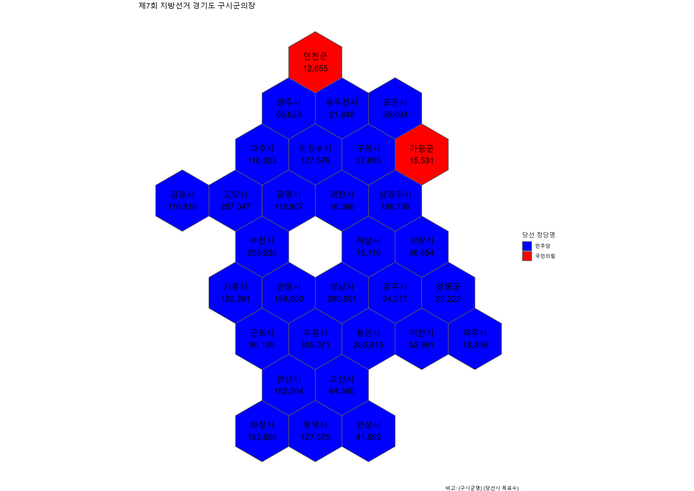

```{r setup, include=FALSE}
knitr::opts_chunk$set(echo = TRUE, message=FALSE, warning=FALSE,
                      comment="", digits = 3, tidy = FALSE, prompt = FALSE, fig.align = 'center')
library(tidyverse)
library(rvest)
library(lubridate)
library(ggrepel)
library(sf)
library(geogrid)
library(tilemaps)
```

# 데이터 {#local-gg-data}


## .득표 데이터 {#local-gg-data-casting}

```{r gg-vote}

gg_raw <- krvote::local_sgg_20180613 %>% 
  filter(str_detect(시도, "경기")) %>% 
  mutate(data = map(data, ~.x %>% pivot_longer(선거인수:기권수, names_to = "후보", values_to = "득표수") ))


gg_dat <- gg_raw %>% 
  unnest(data) %>% 
  filter(!str_detect(후보 , "선거인수|투표수|무효투표수|기권수")) %>% 
  mutate(정당 = case_when(str_detect(후보, "더불어민주당") ~ "민주당", 
                          str_detect(후보, "자유한국당")   ~ "국민의힘",
                          str_detect(후보, "바른미래당")   ~ "바른미래당",
                          str_detect(후보, "정의당") ~ "정의당",
                          str_detect(후보, "계") ~ "계",
                          TRUE ~ "무소속_기타")) %>% 
  group_by(시도, 선거구명, 정당) %>% 
  summarise(득표수 = sum(득표수)) %>% 
  # ungroup() %>% 
  filter(정당 != "계") %>% 
  pivot_wider(names_from = 정당, values_from = 득표수, values_fill = 0) %>% 
  mutate(당선 = case_when(max( 민주당, 국민의힘, 바른미래당, 정의당, 무소속_기타 ) == 민주당 ~ "민주당",
                          max( 민주당, 국민의힘, 바른미래당, 정의당, 무소속_기타 ) == 국민의힘 ~ "국민의힘",    
                          max( 민주당, 국민의힘, 바른미래당, 정의당, 무소속_기타 ) == 바른미래당 ~ "바른미래당",
                          max( 민주당, 국민의힘, 바른미래당, 정의당, 무소속_기타 ) == 정의당 ~ "정의당",
                          max( 민주당, 국민의힘, 바른미래당, 정의당, 무소속_기타 ) == 무소속_기타 ~ "무소속_기타",)) %>% 
  mutate(당선표 = max(민주당, 국민의힘, 바른미래당, 정의당, 무소속_기타 ))

gg_dat
```

## .지도 데이터 {#local-gg-map}

```{r gg-map, eval = FALSE}

library(sf)
library(geogrid)
library(tilemaps)


# 1. 지도 ------------------
## 1.1. 행정구역(SHP) 지도 ----------

### 시도

sido_sf_raw <- sf::st_read("../../docs/election_map/data/map/CTPRVN_202101/TL_SCCO_CTPRVN.shp")

gg_sido_code <- sido_sf_raw %>% 
  mutate(CTP_KOR_NM = iconv(CTP_KOR_NM, from = "CP949", to = "UTF-8", toRaw = FALSE)) %>% 
  filter( str_detect(CTP_KOR_NM, "경기") ) %>% 
  pull(CTPRVN_CD)

### 경기도

sigungu_sf_raw <- sf::st_read("../../docs/election_map/data/map/SIG_202101/TL_SCCO_SIG.shp")

sigungu_gg_sf <- sigungu_sf_raw %>% 
  mutate(SIG_KOR_NM = iconv(SIG_KOR_NM, from = "CP949", to = "UTF-8", toRaw = FALSE)) %>% 
  mutate(CTP_KOR_NM = str_sub(SIG_CD, 1, 2)) %>% 
  filter(CTP_KOR_NM == gg_sido_code) %>% 
  mutate(sgg_code = str_sub(SIG_CD, 1, 4)) %>% 
  group_by(sgg_code) %>% 
  summarise(sgg_name = first(SIG_KOR_NM)) %>% 
  mutate(sgg_name = case_when(str_detect(sgg_name, "수원") ~ "수원시", 
                              str_detect(sgg_name, "안양") ~ "안양시", 
                              str_detect(sgg_name, "용인") ~ "용인시", 
                              str_detect(sgg_name, "성남") ~ "성남시", 
                              str_detect(sgg_name, "고양") ~ "고양시",
                              str_detect(sgg_name, "부천") ~ "부천시",
                              str_detect(sgg_name, "안산") ~ "안산시",
                              TRUE ~ sgg_name                        )) %>% 

  st_simplify(dTolerance = 1000, preserveTopology = TRUE)


pryr::object_size(sigungu_gg_sf)

plot(sigungu_gg_sf)

# 2. 시군구 타일 지도 ------------------

## 2.1. geogrid --------------
library(geogrid)

sigungu_gg_hex <- calculate_grid(shape = sigungu_gg_sf, grid_type = "hexagonal", seed = 3)
sigungu_gg_hex_map_raw <- assign_polygons(sigungu_gg_sf, sigungu_gg_hex)


sigungu_gg_hex_map <- sigungu_gg_hex_map_raw %>%
  dplyr::select(sgg_name) %>% 
  mutate(sgg_name = stringi::stri_escape_unicode(sgg_name))


sigungu_gg_hex_map %>%
  st_write("data/tilemap/sigungu_gg_hex_map.shp",
           delete_layer=TRUE, overwrite=TRUE)

```

# 시각화

## 지도 시각화

```{r gg-shape-sigungu}
sigungu_gg_hex_map <- 
  st_read("data/tilemap/sigungu_gg_hex_map.shp")

sigungu_gg_hex_map %>% 
  mutate(sgg_name = stringi::stri_unescape_unicode(sgg_name)) %>% 
  ggplot() +
    geom_sf() +
    geom_sf_text(aes(geometry = geometry, label = sgg_name),
                 size = 3,
                 fun.geometry = function(x) st_centroid(x)) +
    theme_void()  

```


## 당선 매핑

```{r gg-shape-sigungu-mapping, eval = FALSE}

gg_sigungu_hex_map <- sigungu_gg_hex_map %>% 
  mutate(sgg_name = stringi::stri_unescape_unicode(sgg_name)) %>% 
  left_join(gg_dat, by = c("sgg_name" = "선거구명") ) 

gg_sigungu_g <- gg_sigungu_hex_map %>% 
  ggplot() +
    geom_sf(aes(fill = 당선)) +
    geom_sf_text(aes(geometry = geometry, label = glue::glue("{sgg_name}\n",
                                                             "{scales::comma( 당선표, accuracy =1 )}") ),
                 size = 5,
                 fun.geometry = function(x) st_centroid(x)) +
    scale_fill_manual(values = c("민주당" = "blue",
                                 "국민의힘" = "red")) +
    labs(x="",
         fill = "당선 정당명",
         caption = "비고: {구시군명} {당선시 득표수}",
         title = "제7회 지방선거 경기도 구시군의장") +
    theme(
      text = element_text(family = "NanumGothic"),
      plot.tag.position = c(0.85, .97),
      legend.position = "right",
      legend.title=element_text(size=15), 
      legend.text=element_text(size=13),
      axis.title.y = element_text(size = rel(1.5), colour = "black", family = "NanumBarunpen", face="bold"),      
      strip.text.x = element_text(size = rel(2.5), colour = "black", family = "NanumMyeongjo", face="bold"),
      axis.text.y = element_text(size = rel(1.5), colour = "gray35", family = "NanumBarunpen", face="bold"),
      axis.text.x = element_text(size = rel(1.4), colour = "black", family = "NanumBarunpen", face="bold"),
      strip.background=element_rect(fill="gray95"),
      plot.title=element_text(size=25, face="bold", family = "NanumBarunpen"),
      plot.subtitle=element_text(face="bold", size=17, colour="grey10", family = "NanumBarunpen")) +
    theme_void()   

gg_sigungu_g

ragg::agg_png("fig/gg_sigungu_g.png", width = 297, height = 210, units = "mm", res = 300, scaling = 0.7)
gg_sigungu_g
dev.off()


```


