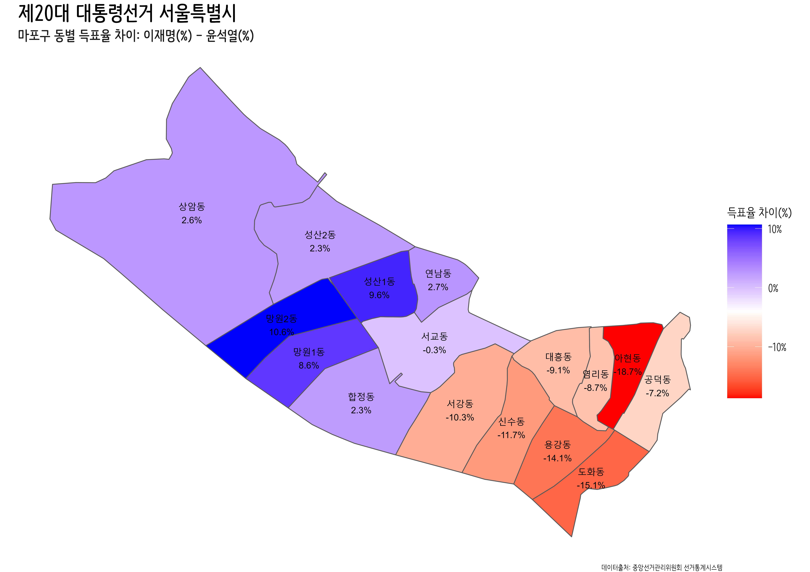
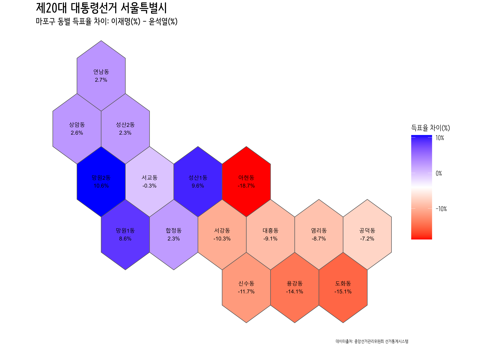
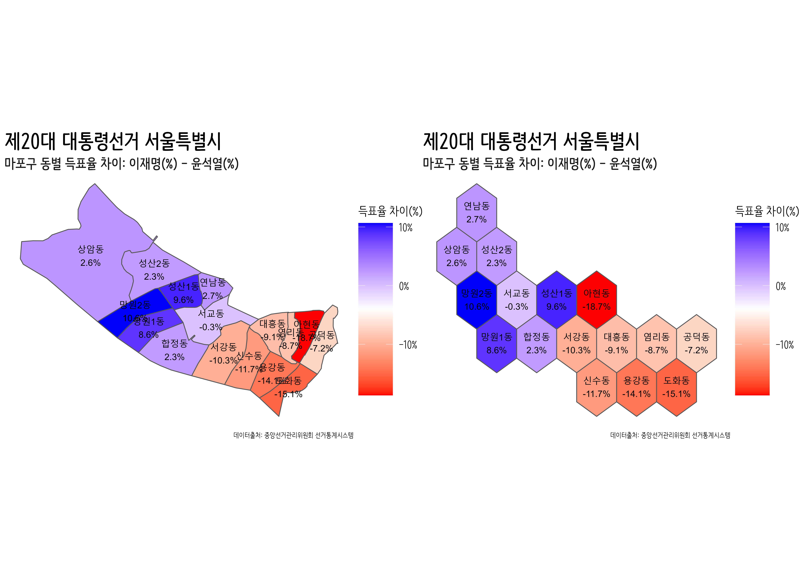

```{r setup, include=FALSE}
knitr::opts_chunk$set(echo = TRUE, message=FALSE, warning=FALSE,
                      comment="", digits = 3, tidy = FALSE, prompt = FALSE, fig.align = 'center')
library(tidyverse)
library(rvest)
library(lubridate)
library(ggrepel)
library(sf)
library(geogrid)
library(tilemaps)

```

# 25개 자치구 데이터 {#local-data}

- 서울특별시
    - 25개 자치구
    - 424개 행정동

## .지도 {#local-seoul-map}

```{r seoul-map-dedup}
### 시도

sido_sf_raw <- sf::st_read("../../docs/election_map/data/map/CTPRVN_202101/TL_SCCO_CTPRVN.shp")

seoul_sido_code <- sido_sf_raw %>% 
  mutate(CTP_KOR_NM = iconv(CTP_KOR_NM, from = "CP949", to = "UTF-8", toRaw = FALSE)) %>% 
  filter( str_detect(CTP_KOR_NM, "서울") ) %>% 
  pull(CTPRVN_CD)

### 서울특별시

sigungu_sf_raw <- sf::st_read("../../docs/election_map/data/map/SIG_202101/TL_SCCO_SIG.shp")

sigungu_seoul_sf <- sigungu_sf_raw %>% 
  mutate(SIG_KOR_NM = iconv(SIG_KOR_NM, from = "CP949", to = "UTF-8", toRaw = FALSE)) %>% 
  mutate(CTP_KOR_NM = str_sub(SIG_CD, 1, 2)) %>% 
  filter(CTP_KOR_NM == seoul_sido_code) %>% 
  mutate(sgg_code = str_sub(SIG_CD, 1, 4)) %>% 
  st_simplify(dTolerance = 100, preserveTopology = TRUE)

pryr::object_size(sigungu_seoul_sf)

sigungu_seoul_sf %>% 
  plot()

```

## .육각형 지도 {#local-seoul-hex-map}

```{r seoul-hex-map}

seoul_hex <- calculate_grid(shape = sigungu_seoul_sf, grid_type = "hexagonal", seed = 3)
seoul_hex_map_raw <- assign_polygons(sigungu_seoul_sf, seoul_hex)


seoul_hex_map <- seoul_hex_map_raw %>%
  dplyr::select(SIG_KOR_NM) %>% 
  mutate(SIG_KOR_NM = stringi::stri_escape_unicode(SIG_KOR_NM))


seoul_hex_map %>%
  st_write("data/tilemap/seoul_hex_map.shp",
           delete_layer=TRUE, overwrite=TRUE)


```


## .지도 시각화 {#local-seoul-hex-map-viz}


```{r seoul-hex-map-viz}

seoul_hex_map <- 
  st_read("data/tilemap/seoul_hex_map.shp") %>% 
  mutate(SIG_KOR_NM = stringi::stri_unescape_unicode(SIG_KOR_NM))


seoul_hex_map %>% 
  ggplot() +
    geom_sf() +
    geom_sf_text(aes(geometry = geometry, label = SIG_KOR_NM), 
            fun.geometry = function(x) st_centroid(x) ) +
    theme_void()

```


# 자치구 마포구 동 데이터 {#local-data-gu-dong}

- 서울특별시
    - 25개 자치구
    - **424개 행정동**

**마포구 행정구역**: 26개의 법정동을 16개의 행정이 관할

## .마포구 지도 {#local-seoul-map-dong}

```{r seoul-map}

SHP_code <- 
  read_rds("data/SHP_code.rds")

mapo_gu_code <- SHP_code %>% 
  filter(str_detect(CTP_KOR_NM, "서울"),
         str_detect(SIG_KOR_NM, "마포"))
  


### 읍면동

emd_sf_raw <- sf::st_read("../../docs/election_map/data/map/EMD_202101/TL_SCCO_EMD.shp")

mapo_gu_sf <- emd_sf_raw %>% 
  mutate(EMD_KOR_NM = iconv(EMD_KOR_NM, from = "CP949", to = "UTF-8", toRaw = FALSE)) %>% 
  inner_join(mapo_gu_code) %>% 
  st_simplify(dTolerance = 50, preserveTopology = TRUE)


pryr::object_size(mapo_gu_sf)

mapo_gu_sf %>% 
  plot()

```

## .마포구 육각형 지도 {#local-seoul-hex-map-mapo}

```{r mapo-hex-map}

mapo_hex <- calculate_grid(shape = mapo_gu_sf, grid_type = "hexagonal", seed = 3)
mapo_hex_map_raw <- assign_polygons(mapo_gu_sf, mapo_hex)


mapo_hex_map <- mapo_hex_map_raw %>%
  dplyr::select(SIG_KOR_NM, EMD_KOR_NM) %>% 
  mutate(SIG_KOR_NM = stringi::stri_escape_unicode(SIG_KOR_NM),
         EMD_KOR_NM = stringi::stri_escape_unicode(EMD_KOR_NM))


mapo_hex_map %>%
  st_write("data/tilemap/mapo_hex_map.shp",
           delete_layer=TRUE, overwrite=TRUE)

```


## .마포구 지도 시각화 {#local-mapo-hex-map-viz}


```{r mapo-hex-map-viz}

mapo_hex_map  <- 
  st_read("data/tilemap/mapo_hex_map.shp") %>% 
  mutate(SIG_KOR_NM = stringi::stri_unescape_unicode(SIG_KOR_NM),
         EMD_KOR_NM = stringi::stri_unescape_unicode(EMD_KOR_NM))


mapo_hex_map %>% 
  ggplot() +
    geom_sf() +
    geom_sf_text(aes(geometry = geometry, label = EMD_KOR_NM), 
            fun.geometry = function(x) st_centroid(x) ) +
    theme_void()

```


## .마포구 지도 + 대선 {#local-mapo-hex-map-viz-data}

```{r mapo-hex-map-viz-data}
mapo_vote_tbl <- krvote::election_20220309$득표율 %>% 
  filter(str_detect(시도명, "서울"),
         str_detect(구시군명, "마포")) %>% 
  group_by(구시군명, 읍면동명) %>% 
  summarise(더불어민주당이재명 = sum(더불어민주당이재명),
            국민의힘윤석열 = sum(국민의힘윤석열),
            정의당심상정 = sum(정의당심상정),
            계 = sum(계)) %>% 
  ungroup() %>% 
  mutate(이재명=더불어민주당이재명/계,
         윤석열=국민의힘윤석열/계,
         심상정=정의당심상정/계) %>% 
  filter(!str_detect(읍면동명, "거소|잘못")) %>% 
  mutate(득표율차이 = 이재명 - 윤석열)

mapo_vote_tbl
```


```{r mapo-hex-map-viz-data-gg}

mapo_vote_sf_tbl <- mapo_vote_tbl %>% 
  filter(! 읍면동명 %in% c("관외사전투표", "재외투표")) %>% 
  mutate(EMD_KOR_NM = case_when(str_detect(읍면동명, "망원") ~ "망원동",
                                str_detect(읍면동명, "성산") ~ "성산",
                                TRUE ~ 읍면동명
                                ) )

mapo_hex_map %>% 
  left_join(mapo_vote_sf_tbl, by = c("EMD_KOR_NM" = "EMD_KOR_NM")) %>% 
  ggplot() +
    geom_sf() +
    geom_sf_text(aes(geometry = geometry, label = glue::glue("{EMD_KOR_NM}\n{scales::percent(득표율차이, accuracy = 0.1)}") ), 
            fun.geometry = function(x) st_centroid(x) ) +
    theme_void()

mapo_hex_map %>% 
  pull(EMD_KOR_NM)
```


# geojson 마포구 동 데이터 {#local-data-gu-dong-geojson}


```{r mapo-geojson, eval = FALSE}
precinct_sf <- st_read("data/tilemap/HangJeongDong_ver20220309.geojson")

mapo_geojson <- precinct_sf  %>% 
  filter(str_detect(ELEC_SIDO, "서울"),
         str_detect(ELEC_GU, "마포") )

mapo_dong_g <- mapo_geojson %>% 
  select(ELEC_SIDO, ELEC_GU, ELEC_EMD) %>% 
  left_join(mapo_vote_tbl %>% filter(! 읍면동명 %in% c("관외사전투표", "재외투표")), by = c("ELEC_EMD" = "읍면동명")) %>% 
  ggplot() +
    geom_sf(aes(geometry = geometry, fill = 득표율차이)) +
    geom_sf_text(aes(geometry = geometry, label = glue::glue("{ELEC_EMD}\n{scales::percent(득표율차이, accuracy = 0.1)}") ), 
            fun.geometry = function(x) st_centroid(x) ) +
    theme_void() +
        scale_fill_gradientn( colours = c("red", "white", "blue"), labels = scales::percent) +
    labs(
      title = "제20대 대통령선거 서울특별시",
      subtitle = "마포구 동별 득표율 차이: 이재명(%) - 윤석열(%)",
      fill = "득표율 차이(%)",
      caption = "데이터출처: 중앙선거관리위원회 선거통계시스템"
    ) +
    theme(
      text = element_text(family = "NanumBarunpen"),
      plot.tag.position = c(0.85, .97),
      legend.position = "right",
      legend.title=element_text(size=15), 
      legend.key.size = unit(1.5, 'cm'),
      legend.text=element_text(size=13),
      plot.title=element_text(size=25, face="bold", family = "NanumBarunpen"),
      plot.subtitle=element_text(face="bold", size=17, colour="grey10", family = "NanumBarunpen"))     

mapo_dong_g

ragg::agg_png("fig/mapo_dong_g.png", width = 297, height = 210, units = "mm", res = 600, scaling = 0.85)
mapo_dong_g
dev.off()


```




# geojson --> 육각형 지도 {#local-data-gu-dong-geojson-hex}


```{r mapo-geojson-hex, eval = FALSE}

mapo_hex <- calculate_grid(shape = mapo_geojson, grid_type = "hexagonal", seed = 3)
mapo_hex_map_raw <- assign_polygons(mapo_geojson, mapo_hex)


mapo_hex_map <- mapo_hex_map_raw %>%
  dplyr::select(ELEC_GU, ELEC_EMD) %>% 
  mutate(ELEC_GU = stringi::stri_escape_unicode(ELEC_GU),
         ELEC_EMD = stringi::stri_escape_unicode(ELEC_EMD))

mapo_hex_map %>%
  st_write("data/tilemap/mapo_hex_map.shp",
           delete_layer=TRUE, overwrite=TRUE)
```


```{r mapo-geojson-hex-data, eval = FALSE}

mapo_hex_map  <- 
  st_read("data/tilemap/mapo_hex_map.shp") %>% 
  mutate(ELEC_GU = stringi::stri_unescape_unicode(ELEC_GU),
         ELEC_EMD = stringi::stri_unescape_unicode(ELEC_EMD))

mapo_dong_hex_g <- mapo_hex_map %>% 
  select(ELEC_GU, ELEC_EMD) %>% 
  left_join(mapo_vote_tbl %>% filter(! 읍면동명 %in% c("관외사전투표", "재외투표")), by = c("ELEC_EMD" = "읍면동명")) %>% 
  ggplot() +
    geom_sf(aes(geometry = geometry, fill = 득표율차이)) +
    geom_sf_text(aes(geometry = geometry, label = glue::glue("{ELEC_EMD}\n{scales::percent(득표율차이, accuracy = 0.1)}") ), 
            fun.geometry = function(x) st_centroid(x) ) +
    theme_void() +
        scale_fill_gradientn( colours = c("red", "white", "blue"), labels = scales::percent) +
    labs(
      title = "제20대 대통령선거 서울특별시",
      subtitle = "마포구 동별 득표율 차이: 이재명(%) - 윤석열(%)",
      fill = "득표율 차이(%)",
      caption = "데이터출처: 중앙선거관리위원회 선거통계시스템"
    ) +
    theme(
      text = element_text(family = "NanumBarunpen"),
      plot.tag.position = c(0.85, .97),
      legend.position = "right",
      legend.title=element_text(size=15), 
      legend.key.size = unit(1.5, 'cm'),
      legend.text=element_text(size=13),
      plot.title=element_text(size=25, face="bold", family = "NanumBarunpen"),
      plot.subtitle=element_text(face="bold", size=17, colour="grey10", family = "NanumBarunpen"))

mapo_dong_hex_g

ragg::agg_png("fig/mapo_dong_hex_g.png", width = 297, height = 210, units = "mm", res = 600, scaling = 0.85)
mapo_dong_hex_g
dev.off()

```





```{r hex-original-map, eval = FALSE}
library(patchwork)

mapo_dong_g + mapo_dong_hex_g

ragg::agg_png("fig/mapo_dong_original_hex_g.png", width = 297, height = 210, units = "mm", res = 600, scaling = 0.85)
mapo_dong_g + mapo_dong_hex_g
dev.off()


```




