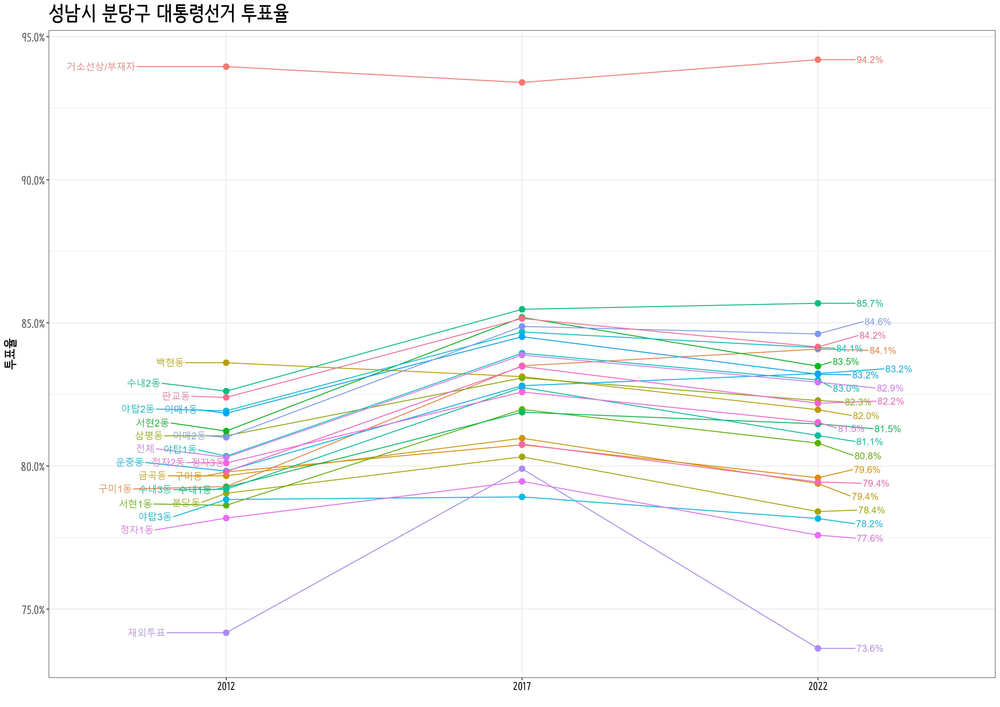

```{r setup, include=FALSE}
knitr::opts_chunk$set(echo = TRUE, message=FALSE, warning=FALSE,
                      comment="", digits = 3, tidy = FALSE, prompt = FALSE, fig.align = 'center')
library(tidyverse)
library(rvest)
library(lubridate)
library(ggrepel)
```

# 데이터 {#local-data}

- 성남시
    - 전체
    - 3구
    - 동
    - 투표소(?)

## 투표율 {#local-data-casting}

```{r bundang-casting}

sungnam_raw <- tibble(연도 = c("2012", "2017", "2022"),
       data = list(krvote::election_20121219$투표율,
                krvote::election_20170509$투표율,
                krvote::election_20220309$투표율) )

bd_casting_raw <- sungnam_raw %>% 
  mutate(성남 = map(data, ~.x %>% filter(str_detect(구시군명, "분당구")))) %>% 
  select(연도, 성남) %>% 
  unnest(성남)


dong_casting <- bd_casting_raw %>% 
  group_by(연도, 구시군명, 읍면동명) %>% 
  summarise(선거인수 = sum(선거인수),
            투표수   = sum(투표수)) %>% 
  ungroup() %>% 
  mutate(투표율 = 투표수 / 선거인수)

dong_casting 

```

# 시각화 {#bundang}

## 투표율 {#bundang-casting}


```{r bundang-casting-overall, eval = FALSE}
library(ggrepel)

bundang_casting_total <- dong_casting %>% 
  group_by(연도) %>% 
  summarise(선거인수 = sum(선거인수),
            투표수   = sum(투표수)) %>% 
  ungroup() %>% 
  mutate(투표율 = 투표수 / 선거인수) %>% 
  mutate(구시군명 = "전체") %>% 
  mutate(읍면동명 = "전체")

dong_casting_tbl <- dong_casting %>% 
  bind_rows(bundang_casting_total) %>% 
  filter(!str_detect(읍면동명, "잘못|관외사전투표")) %>% 
  mutate(읍면동명 = case_when(str_detect(읍면동명, "선상투표") ~ "거소선상/부재자",
                              str_detect(읍면동명, "부재자") ~ "거소선상/부재자",
                              TRUE ~ 읍면동명)) %>% 
  mutate(구시군명 = str_remove(구시군명, "성남시"))


dong_casting_g <- dong_casting_tbl %>% 
  ggplot(aes(x = 연도, y = 투표율, group = 읍면동명)) +
    geom_line(aes(color = 읍면동명)) +
    geom_point(aes(color = 읍면동명), size = 3) +
    scale_y_continuous(labels = scales::percent) +
    labs(x="",
         title = "성남시 분당구 대통령선거 투표율") +
        theme_bw(base_family = "NanumBarunPen") +
    theme(
      text = element_text(family = "NanumGothic"),
      plot.tag.position = c(0.85, .97),
      legend.position = "none",
      legend.title=element_text(size=15), 
      legend.text=element_text(size=13),
      axis.title.y = element_text(size = rel(1.5), colour = "black", family = "NanumBarunpen", face="bold"),      
      strip.text.x = element_text(size = rel(2.5), colour = "black", family = "NanumMyeongjo", face="bold"),
      axis.text.y = element_text(size = rel(1.5), colour = "gray35", family = "NanumBarunpen", face="bold"),
      axis.text.x = element_text(size = rel(1.4), colour = "black", family = "NanumBarunpen", face="bold"),
      strip.background=element_rect(fill="gray95"),
      plot.title=element_text(size=25, face="bold", family = "NanumBarunpen"),
      plot.subtitle=element_text(face="bold", size=17, colour="grey10", family = "NanumBarunpen")) +
      geom_text_repel(data = dong_casting_tbl  %>% filter(연도 == "2022"),
                      aes(label = scales::percent(투표율, accuracy =0.1), color = 읍면동명), hjust = -2, size = 4 ) +
      geom_text_repel(data = dong_casting_tbl  %>% filter(연도 == "2012"),
                      aes(label = 읍면동명, color = 읍면동명), hjust = +3, size = 4 )

dong_casting_g

ragg::agg_png("fig/dong_casting_g.png", width = 297, height = 210, units = "mm", res = 300, scaling = 0.7)
dong_casting_g
dev.off()


```





