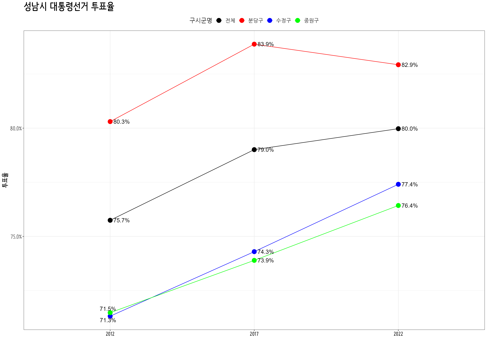
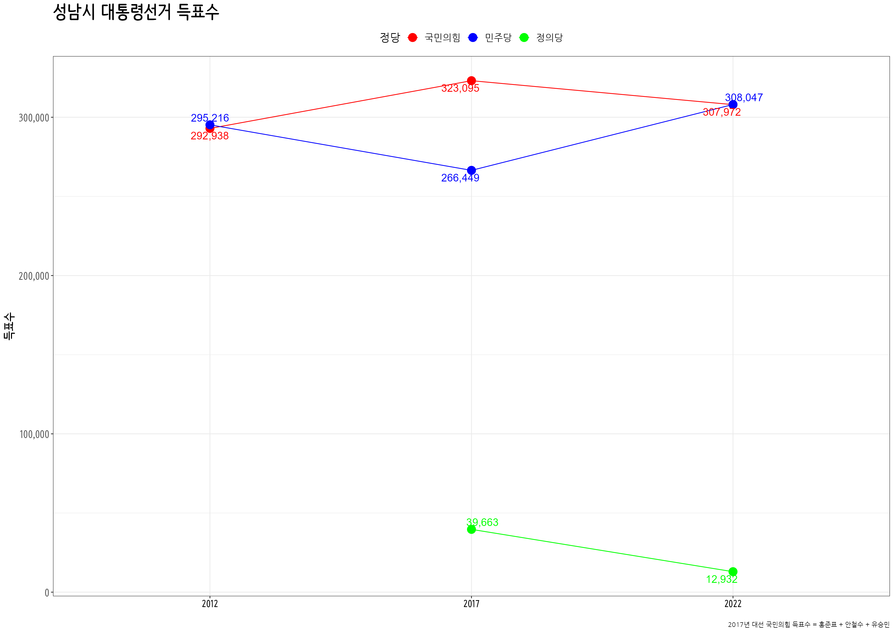
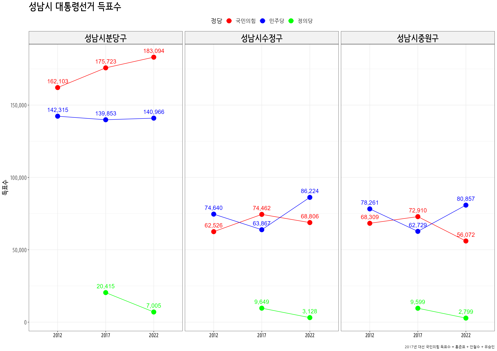
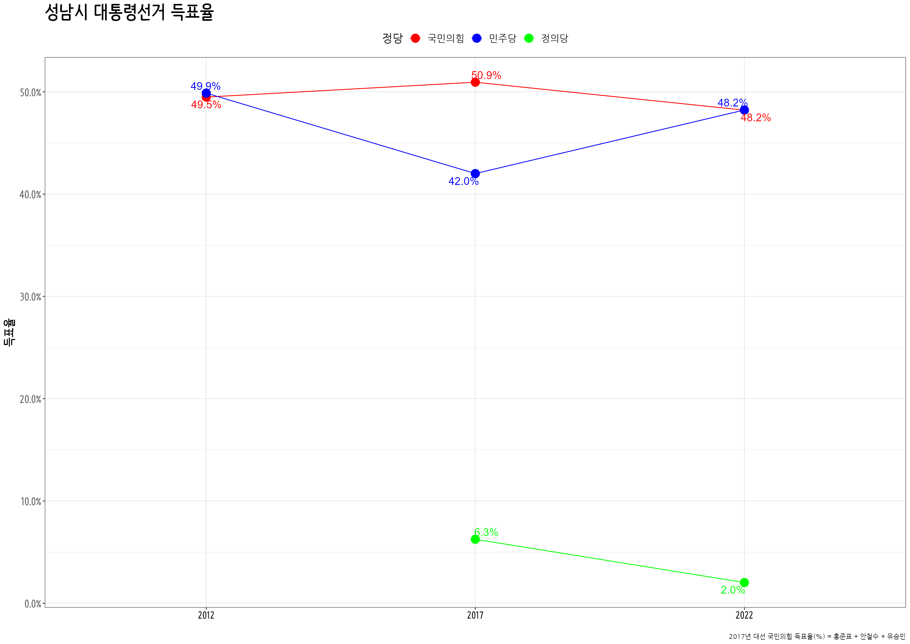
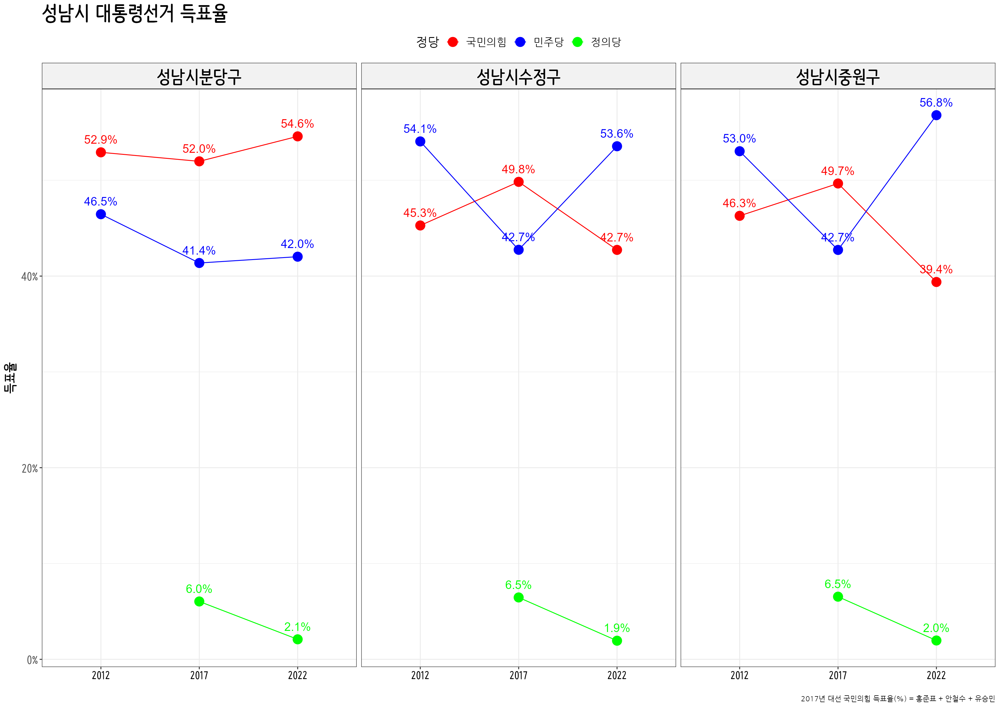

```{r setup, include=FALSE}
knitr::opts_chunk$set(echo = TRUE, message=FALSE, warning=FALSE,
                      comment="", digits = 3, tidy = FALSE, prompt = FALSE, fig.align = 'center')
library(tidyverse)
library(rvest)
library(lubridate)
library(ggrepel)
```

# 데이터 {#local-data}

- 성남시
    - 전체
    - 3구
    - 동
    - 투표소(?)

## 투표율 {#local-data-casting}

```{r sungnam-casting}

sungnam_raw <- tibble(연도 = c("2012", "2017", "2022"),
       data = list(krvote::election_20121219$투표율,
                krvote::election_20170509$투표율,
                krvote::election_20220309$투표율) )

sn_casting_raw <- sungnam_raw %>% 
  mutate(성남 = map(data, ~.x %>% filter(str_detect(구시군명, "성남")))) %>% 
  select(연도, 성남) %>% 
  unnest(성남)


sn_casting <- sn_casting_raw %>% 
  group_by(연도, 구시군명) %>% 
  summarise(선거인수 = sum(선거인수),
            투표수   = sum(투표수)) %>% 
  ungroup() %>% 
  mutate(투표율 = 투표수 / 선거인수)

sn_casting

```

## 득표수  {#sungnam-voting}

```{r}
voting_raw <- tibble(연도 = c("2012", "2017", "2022"),
       data = list(krvote::election_20121219$득표율,
                krvote::election_20170509$득표율,
                krvote::election_20220309$득표율) )

sn_voting <- voting_raw %>% 
  mutate(data = map(data, ~.x %>% pivot_longer(선거인수:계, names_to = "후보", values_to = "득표수"))) %>% 
  unnest(data) %>% 
  filter(str_detect(구시군명, "성남")) %>% 
  filter(str_detect(후보, "박근혜|문재인|안철수|홍준표|유승민|심상정|이재명|윤석열")) %>% 
  mutate(정당 = case_when(str_detect(후보, "문재인|이재명") ~ "민주당",
                          str_detect(후보, "심상정") ~ "정의당",
                          TRUE ~ "국민의힘")) %>% 
  group_by(연도, 구시군명, 정당) %>% 
  summarise(득표수 = sum(득표수)) %>% 
  ungroup()
```

## 득표율 {#sungnam-voting-rate}

```{r sn-voting-rate}

sn_voting_hubo <- voting_raw %>% 
  mutate(data = map(data, ~.x %>% pivot_longer(선거인수:계, names_to = "후보", values_to = "득표수"))) %>% 
  unnest(data) %>% 
  filter(str_detect(구시군명, "성남")) %>% 
  filter(str_detect(후보, "박근혜|문재인|안철수|홍준표|유승민|심상정|이재명|윤석열")) %>% 
  mutate(정당 = case_when(str_detect(후보, "문재인|이재명") ~ "민주당",
                          str_detect(후보, "심상정") ~ "정의당",
                          TRUE ~ "국민의힘")) %>% 
  group_by(연도, 구시군명, 정당) %>% 
  summarise(득표수 = sum(득표수)) %>% 
  ungroup()

sn_voting_total <- voting_raw %>% 
  mutate(data = map(data, ~.x %>% pivot_longer(선거인수:계, names_to = "후보", values_to = "득표수"))) %>% 
  unnest(data) %>% 
  filter(str_detect(구시군명, "성남")) %>% 
  filter(str_detect(후보, "투표수")) %>% 
  group_by(연도, 구시군명) %>% 
  summarise(투표수 = sum(득표수)) %>% 
  ungroup()

sn_voting_pcnt <- sn_voting_hubo %>% 
  left_join(sn_voting_total) %>% 
  mutate(득표율 = 득표수 / 투표수)

sn_voting_pcnt

```


# 시각화 {#sungnam}

## 투표율 {#sungnam-casting}


```{r sungam-casting-overall, eval = FALSE}
library(ggrepel)

sn_casting_total <- sn_casting_raw %>% 
  group_by(연도) %>% 
  summarise(선거인수 = sum(선거인수),
            투표수   = sum(투표수)) %>% 
  ungroup() %>% 
  mutate(투표율 = 투표수 / 선거인수) %>% 
  mutate(구시군명 = "전체")

sn_casting_g <- sn_casting %>% 
  bind_rows(sn_casting_total) %>% 
  mutate(구시군명 = str_remove(구시군명, "성남시")) %>% 
  mutate(구시군명 = factor(구시군명, levels = c("전체", "분당구", "수정구", "중원구"))) %>% 
  ggplot(aes(x = 연도, y = 투표율, group = 구시군명)) +
    geom_line(aes(color = 구시군명)) +
    geom_point(aes(color = 구시군명), size = 5) +
    scale_y_continuous(labels = scales::percent) +
    labs(x="",
         title = "성남시 대통령선거 투표율") +
        theme_bw(base_family = "NanumBarunPen") +
    theme(
      text = element_text(family = "NanumGothic"),
      plot.tag.position = c(0.85, .97),
      legend.position = "top",
      legend.title=element_text(size=15), 
      legend.text=element_text(size=13),
      axis.title.y = element_text(size = rel(1.5), colour = "black", family = "NanumBarunpen", face="bold"),      
      strip.text.x = element_text(size = rel(2.5), colour = "black", family = "NanumMyeongjo", face="bold"),
      axis.text.y = element_text(size = rel(1.5), colour = "gray35", family = "NanumBarunpen", face="bold"),
      axis.text.x = element_text(size = rel(1.4), colour = "black", family = "NanumBarunpen", face="bold"),
      strip.background=element_rect(fill="gray95"),
      plot.title=element_text(size=25, face="bold", family = "NanumBarunpen"),
      plot.subtitle=element_text(face="bold", size=17, colour="grey10", family = "NanumBarunpen")) +
      geom_text_repel(aes(label = scales::percent(투표율, accuracy =0.1)), hjust = 1, size = 5 ) +
      scale_color_manual(values = c("전체"   = "black",
                                    "분당구" = "red",
                                    "수정구" = "blue",
                                    "중원구" = "green"))  

sn_casting_g

ragg::agg_png("fig/sn_casting_g.png", width = 297, height = 210, units = "mm", res = 300, scaling = 0.7)
sn_casting_g
dev.off()

```




## 득표수  {#sn-votes}


```{r sungam-voting-count, eval = FALSE}
sn_voting_count_overall_g <- sn_voting %>% 
  group_by(연도, 정당) %>% 
  summarise(득표수 = sum(득표수)) %>% 
  ggplot(aes(x = 연도, y = 득표수, color = 정당, group = 정당)) +
    geom_point() +
    geom_line() +
    geom_point(size = 5) +
    scale_y_continuous(labels = scales::comma) +
    labs(x="",
         title = "성남시 대통령선거 득표수",
         caption = "2017년 대선 국민의힘 득표수 = 홍준표 + 안철수 + 유승민") +
         theme_bw(base_family = "NanumBarunPen") +
    theme(
      text = element_text(family = "NanumGothic"),
      plot.tag.position = c(0.85, .97),
      legend.position = "top",
      legend.title=element_text(size=15), 
      legend.text=element_text(size=13),
      axis.title.y = element_text(size = rel(1.5), colour = "black", family = "NanumBarunpen", face="bold"),      
      strip.text.x = element_text(size = rel(2.5), colour = "black", family = "NanumBarunpen", face="bold"),
      axis.text.y = element_text(size = rel(1.5), colour = "gray35", family = "NanumBarunpen", face="bold"),
      axis.text.x = element_text(size = rel(1.4), colour = "black", family = "NanumBarunpen", face="bold"),
      strip.background=element_rect(fill="gray95"),
      plot.title=element_text(size=25, face="bold", family = "NanumBarunpen"),
      plot.subtitle=element_text(face="bold", size=17, colour="grey10", family = "NanumBarunpen"))  +
    geom_text_repel(aes(label = scales::comma(득표수)), size = 5 ) +
      scale_color_manual(values = c("국민의힘" = "red",
                                    "민주당" = "blue",
                                    "정의당" = "green"))

sn_voting_count_overall_g

ragg::agg_png("fig/sn_voting_count_overall_g", width = 297, height = 210, units = "mm", res = 300, scaling = 0.7)
sn_voting_count_overall_g
dev.off()

```



### 3구 {#sn-votes-overall-three}

```{r sungam-voting-count-three, eval = FALSE}

sn_voting_count_g <- sn_voting %>% 
  ggplot(aes(x = 연도, y = 득표수, color = 정당, group = 정당)) +
    geom_point() +
    geom_line() +
    facet_wrap( ~ 구시군명) +
    geom_point(size = 5) +
    scale_y_continuous(labels = scales::comma) +
    labs(x="",
         title = "성남시 대통령선거 득표수",
         caption = "2017년 대선 국민의힘 득표수 = 홍준표 + 안철수 + 유승민") +
         theme_bw(base_family = "NanumBarunPen") +
    theme(
      text = element_text(family = "NanumGothic"),
      plot.tag.position = c(0.85, .97),
      legend.position = "top",
      legend.title=element_text(size=15), 
      legend.text=element_text(size=13),
      axis.title.y = element_text(size = rel(1.5), colour = "black", family = "NanumBarunpen", face="bold"),      
      strip.text.x = element_text(size = rel(2.5), colour = "black", family = "NanumBarunpen", face="bold"),
      axis.text.y = element_text(size = rel(1.5), colour = "gray35", family = "NanumBarunpen", face="bold"),
      axis.text.x = element_text(size = rel(1.4), colour = "black", family = "NanumBarunpen", face="bold"),
      strip.background=element_rect(fill="gray95"),
      plot.title=element_text(size=25, face="bold", family = "NanumBarunpen"),
      plot.subtitle=element_text(face="bold", size=17, colour="grey10", family = "NanumBarunpen"))  +
    geom_text(aes(label = scales::comma(득표수)), vjust = -1.0, size = 5 ) +
      scale_color_manual(values = c("국민의힘" = "red",
                                    "민주당" = "blue",
                                    "정의당" = "green"))

sn_voting_count_g

ragg::agg_png("fig/sn_voting_count_g.png", width = 297, height = 210, units = "mm", res = 300, scaling = 0.7)
sn_voting_count_g
dev.off()

```



## 득표율 {#sn-voting-rate}

### 성남시 전체 {#sn-voting-rate-overall}

```{r sungam-voting-rate-overall, eval = FALSE}

sn_voting_pcnt_overall_g <- sn_voting_pcnt %>% 
  group_by(연도, 정당) %>% 
  summarise(득표수 = sum(득표수),
            투표수 = sum(투표수)) %>% 
  ungroup() %>% 
  mutate(득표율 = 득표수 / 투표수) %>% 
  ggplot(aes(x = 연도, y = 득표율, color = 정당, group = 정당)) +
    geom_point() +
    geom_line() +
    geom_point(size = 5) +
    scale_y_continuous(labels = scales::percent) +
    labs(x="",
         title = "성남시 대통령선거 득표율",
         caption = "2017년 대선 국민의힘 득표율(%) = 홍준표 + 안철수 + 유승민") +
         theme_bw(base_family = "NanumBarunPen") +
    theme(
      text = element_text(family = "NanumGothic"),
      plot.tag.position = c(0.85, .97),
      legend.position = "top",
      legend.title=element_text(size=15), 
      legend.text=element_text(size=13),
      axis.title.y = element_text(size = rel(1.5), colour = "black", family = "NanumBarunpen", face="bold"),      
      strip.text.x = element_text(size = rel(2.5), colour = "black", family = "NanumBarunpen", face="bold"),
      axis.text.y = element_text(size = rel(1.5), colour = "gray35", family = "NanumBarunpen", face="bold"),
      axis.text.x = element_text(size = rel(1.4), colour = "black", family = "NanumBarunpen", face="bold"),
      strip.background=element_rect(fill="gray95"),
      plot.title=element_text(size=25, face="bold", family = "NanumBarunpen"),
      plot.subtitle=element_text(face="bold", size=17, colour="grey10", family = "NanumBarunpen"))  +
    geom_text_repel(aes(label = scales::percent(득표율, accuracy = 0.1)), size = 5 ) +
      scale_color_manual(values = c("국민의힘" = "red",
                                    "민주당" = "blue",
                                    "정의당" = "green"))

sn_voting_pcnt_overall_g

ragg::agg_png("fig/sn_voting_pcnt_overall_g.png", width = 297, height = 210, units = "mm", res = 300, scaling = 0.7)
sn_voting_pcnt_overall_g
dev.off()

```




### 3구 {#sn-voting-rate-three}

```{r sungam-voting-rate-three, eval = FALSE}

sn_voting_pcnt_g <- sn_voting_pcnt %>% 
  ggplot(aes(x = 연도, y = 득표율, color = 정당, group = 정당)) +
    geom_point() +
    geom_line() +
    facet_wrap( ~ 구시군명) +
    geom_point(size = 5) +
    scale_y_continuous(labels = scales::percent) +
    labs(x="",
         title = "성남시 대통령선거 득표율",
         caption = "2017년 대선 국민의힘 득표율(%) = 홍준표 + 안철수 + 유승민") +
         theme_bw(base_family = "NanumBarunPen") +
    theme(
      text = element_text(family = "NanumGothic"),
      plot.tag.position = c(0.85, .97),
      legend.position = "top",
      legend.title=element_text(size=15), 
      legend.text=element_text(size=13),
      axis.title.y = element_text(size = rel(1.5), colour = "black", family = "NanumBarunpen", face="bold"),      
      strip.text.x = element_text(size = rel(2.5), colour = "black", family = "NanumBarunpen", face="bold"),
      axis.text.y = element_text(size = rel(1.5), colour = "gray35", family = "NanumBarunpen", face="bold"),
      axis.text.x = element_text(size = rel(1.4), colour = "black", family = "NanumBarunpen", face="bold"),
      strip.background=element_rect(fill="gray95"),
      plot.title=element_text(size=25, face="bold", family = "NanumBarunpen"),
      plot.subtitle=element_text(face="bold", size=17, colour="grey10", family = "NanumBarunpen"))  +
    geom_text(aes(label = scales::percent(득표율, accuracy = 0.1)), vjust = -1.0, size = 5 ) +
      scale_color_manual(values = c("국민의힘" = "red",
                                    "민주당" = "blue",
                                    "정의당" = "green"))

sn_voting_pcnt_g

ragg::agg_png("fig/sn_voting_pcnt_g.png", width = 297, height = 210, units = "mm", res = 300, scaling = 0.7)
sn_voting_pcnt_g
dev.off()
```




